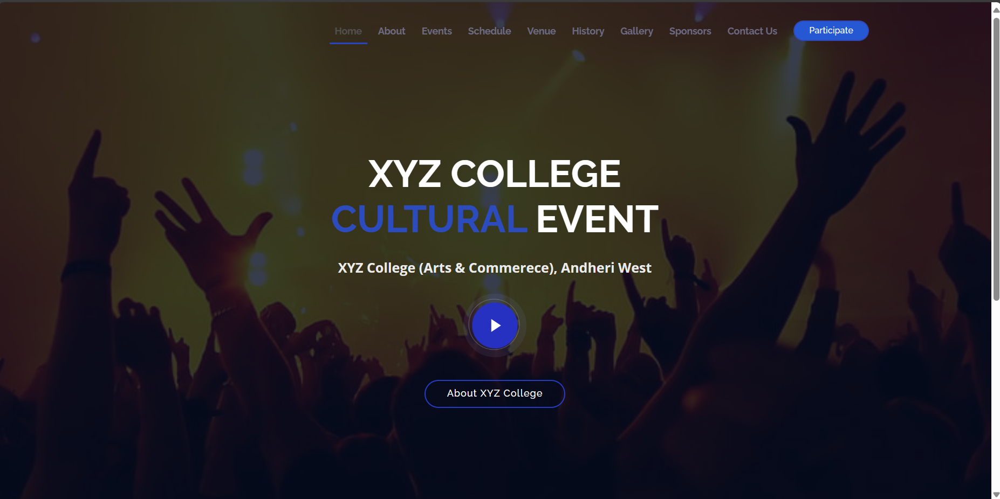
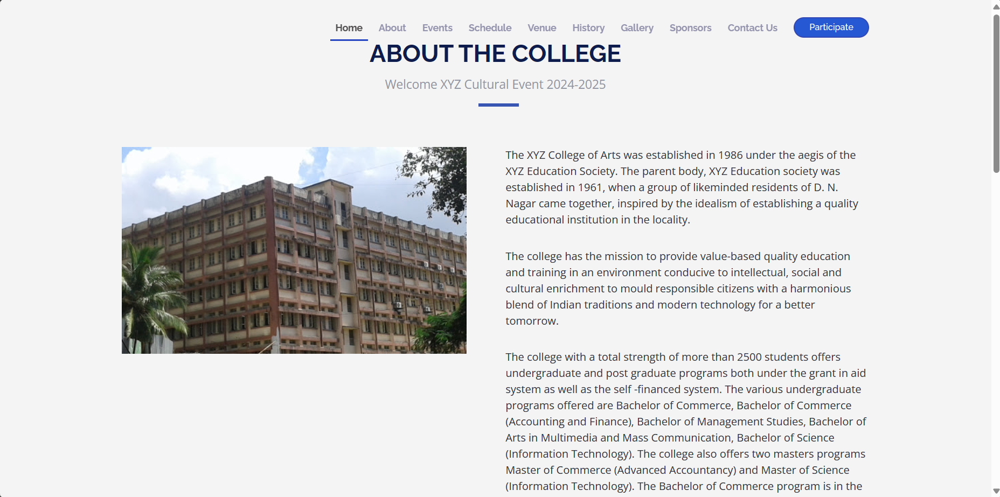

# College-Event-Management-System
# I'm making College Event Mangement System by using Python Flask
 I'm Using Google Gmail API to send and receive mail to user or Organizer

 libraries Required
 pip install googleapi,  
 pip install reportlab, 
 pip install Flask Flask-Mail Flask-SQLAlchemy Flask-Bcrypt google-auth-oauthlib google-auth
 Using JSON file to connecting Gmail API and changed the team member name and Event Name 

# Home Page

# About Page

# Event Page
We used Xampp application to connect mysql with system 
the admin able to upload the events and the user can only view the events 
So we create the database with name XYZ 
Database class create successfully

# Gmail API Connected Successfully
Google provide token.json where the connection details is given

