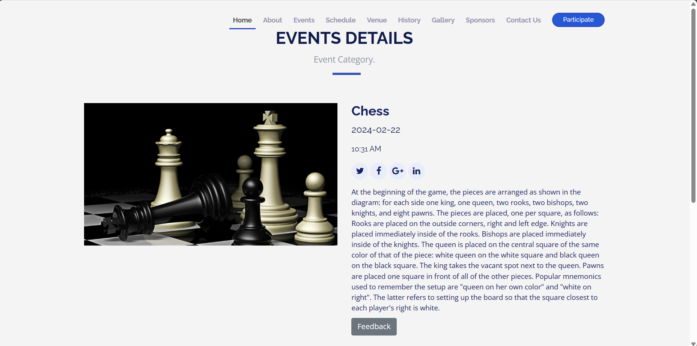

# College-Event-Management-System
# I'm making College Event Mangement System by using Python Flask
 I'm Using Google Gmail API to send and receive mail to user or Organizer

 libraries Required
 pip install googleapi,  
 pip install reportlab, 
 pip install Flask Flask-Mail Flask-SQLAlchemy Flask-Bcrypt google-auth-oauthlib google-auth
 Using JSON file to connecting Gmail API and changed the team member name and Event Name 

# Home Page

# About Page

# Event Page
We used Xampp application to connect mysql with system 
the admin able to upload the events and the user can only view the events 
So we create the database with name XYZ.
Database class create successfully.
The images are save in uploads_event

Events Details 

# Schedule Page
We create a schedule page which is connect mysql.
the admin able to upload the schedule and the user can only view the schedule for events.
so we create the table in XYZ database to upload schedule.

for day 2

# Past Event
We Create Past 3 year event Images

# Gallery 
Which contain current event images the admin will be uploaded images 

# Gmail API Connected Successfully
Google provide token.json where the connection details is given

# Registration form 
When the user register for the event he will recieve mail from college for successfully registered 

# Term and Condition page
Added term and condition for website

